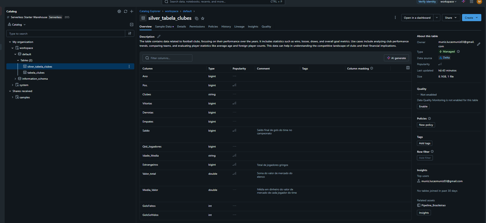

# MVP de Engenharia de Dados - Brasileirão ⚽📊

Fala, pessoal! Este repositório contém o MVP (Minimum Viable Product) que desenvolvi para a disciplina de Engenharia de Dados da minha pós-graduação.

A ideia aqui foi sair da teoria e botar a mão na massa construindo um pipeline de dados de ponta a ponta na nuvem.

---

## 🎯 Contexto de Negócios e Perguntas (Etapas 2 e 4.1)

Sempre ouvimos que "dinheiro não entra em campo", mas até que ponto isso é verdade num campeonato de pontos corridos? O objetivo deste projeto foi cruzar estatísticas puras do jogo (vitórias, gols, saldo) com informações financeiras e de gestão de elenco (valor de mercado, média de idade, quantidade de estrangeiros) para tentar descobrir o que realmente faz um time pontuar.

Para guiar o pipeline, defini 4 perguntas principais:
1. O dinheiro compra resultado em campo?
2. Experiência vs. Juventude: quem entrega mais saldo de gols?
3. O Fator Gringo: vale a pena trazer estrangeiros?
4. **Eficiência Financeira:** Qual é o custo médio de cada ponto conquistado na tabela? Quem gasta melhor?

Para isso, peguei uma base pública do Kaggle com dados do Campeonato Brasileiro de 2009 a 2018 (extraídos do Transfermarkt). A licença dos dados atende aos requisitos de dados abertos (CC0: Domínio Público).

---

## ☁️ Carga dos Dados (Etapa 4.2)

Todo o ambiente foi montado na nuvem utilizando o **Databricks (Community Edition)**. 

A carga inicial (Ingestão) foi feita através do upload do arquivo bruto `Tabela_Clubes.csv` diretamente para o DBFS (Databricks File System) utilizando a interface visual da plataforma.

---

## 🏗️ Pipeline de Dados (Etapa 4.4)

Utilizei a **Arquitetura Medalhão** para organizar o fluxo do dado e concentrei o processo em um Notebook documentado:

*   **🥉 Camada Bronze (Extract):** Leitura do dado bruto. A ideia é manter o dado original intacto para rastreabilidade, servindo como nosso cofre de evidências.
*   **🥈 Camada Silver (Transform & Load):** Onde a mágica do ETL aconteceu. Usei **PySpark** para fazer a limpeza, tipagem e regras de qualidade (detalhadas no tópico abaixo). O DataFrame resultante foi salvo em formato **Delta Lake**, garantindo performance de leitura e segurança (transações ACID).
*   **🥇 Camada Gold (Análises):** Fui para o SQL puro dentro do Databricks para modelar os dados, cruzar informações financeiras com as esportivas e extrair as respostas de negócio.

---

## 🧹 Análise de Qualidade de Dados (Etapa 4.5)

Antes de gerar qualquer insight, a Camada Silver foi responsável por garantir a confiabilidade da base. Analisando os atributos brutos, apliquei os seguintes tratamentos:

*   **Consistência e Atomicidade:** A coluna original de gols misturava gols a favor e contra na mesma string (ex: `30:47`). Usei um *split* no PySpark para criar duas colunas atômicas e inteiras (`GolsFeitos` e `GolsSofridos`).
*   **Acurácia:** Os anos das temporadas estavam defasados em relação à realidade do campeonato. Apliquei uma regra somando `+1` à coluna de Ano. Além disso, valores financeiros que vieram em formato de texto foram devidamente convertidos (cast) para `Double`.
*   **Completude e Unicidade:** A base não apresentou valores nulos críticos nem duplicatas que ferissem a granularidade de "Um clube por ano".
*   **Outliers:** Identifiquei clubes com valores de elenco discrepantes (muito acima da média). Eles foram propositalmente mantidos na base, pois refletem a realidade da desigualdade financeira do futebol brasileiro e são a peça chave para responder à Pergunta 1.

---

## 🗂️ Modelagem e Catálogo de Dados (Etapa 4.3)

A modelagem adotou o padrão de *Flat Table* (Tabela Única Desnormalizada), excelente para análises diretas em Data Lakehouses. Para não deixar o dado "jogado", usei o **Unity Catalog** do Databricks para documentar a tabela Silver. 

Aceitei a descrição gerada por IA e adicionei comentários nas colunas de regra de negócio, garantindo a governança da base.

**Dicionário de Dados Transcrito:**

| Coluna | Tipo (Delta) | Descrição do Campo |
| :--- | :--- | :--- |
| **Ano** | `bigint` | Ano (temporada) de referência do campeonato. |
| **Posicao** | `bigint` | Posição final ocupada pelo clube na tabela. |
| **Clubes** | `string` | Nome oficial do clube. |
| **Vitorias** | `bigint` | Quantidade de partidas vencidas. |
| **Derrotas** | `bigint` | Quantidade de partidas perdidas. |
| **Empates** | `bigint` | Quantidade de partidas empatadas. |
| **Saldo** | `bigint` | Saldo final de gols do time no campeonato. |
| **Qtd_Jogadores** | `bigint` | Quantidade de atletas no elenco. |
| **Idade_Media** | `string` | Média de idade do elenco. |
| **Estrangeiros** | `bigint` | Total de jogadores gringos. |
| **Valor_total** | `double` | Soma do valor de mercado (dinheiro) do elenco. |
| **Media_Valor** | `double` | Média em dinheiro do valor de cada jogador. |
| **GolsFeitos** | `int` | Total de gols marcados pelo time. |
| **GolsSofridos** | `int` | Total de gols sofridos pelo time. |

---

## 📈 Análise de Dados e Respostas (Etapa 4.5)

Com a base limpa, as perguntas foram respondidas na Camada Gold:

**1. O Dinheiro compra resultado em campo?**
> A resposta é **SIM**. O gráfico mostra que os times do G4 (1º ao 4º) ostentam médias de valor de elenco lá em cima, na casa dos 50 a 60 milhões. Já os times na zona de rebaixamento tem elencos mais baratos, na faixa dos 20 milhões. O poder de investimento dita claramente a tendência da tabela.

**2. Experiência vs. Juventude: quem entrega mais saldo de gols?**
> **A juventude levou a melhor**. Times com média de idade entre 22 e 23 anos conseguiram segurar um saldo de gols médio positivo (fazem mais do que sofrem). Conforme a média de idade passa dos 25 anos, o saldo despenca e fica negativo. Campeonato longo exige fôlego físico!

**3. O Fator Gringo: vale a pena trazer estrangeiros?**
> **Sim**, existe um "ponto de equilíbrio". A média de vitórias sobe conforme a contratação de estrangeiros aumenta, atingindo o pico (16.2 vitórias) nos times que têm exatamente 4 gringos. Passou de 5 estrangeiros, a média dá uma leve recuada, sugerindo o limite ideal para mesclar com a base nacional.

**4. A Eficiência Financeira (O "Moneyball" Brasileiro)**
> Para descobrir a real eficiência, calculei o total de pontos (Vitórias x 3 + Empates) e dividi pelo Valor Total do Elenco. O resultado foi fascinante: enquanto gigantes como São Paulo e Flamengo chegam a gastar mais de 1 milhão de reais por cada ponto conquistado, times modestos como Joinville e Prudente conseguiram um ponto custando cerca de 100 a 118 mil reais. O dinheiro compra posições altas, mas o custo da eficiência para os times de ponta é inflacionado e desproporcional.

---

## 🧠 Autoavaliação

Foi um baita desafio sair da teoria e ver o pipeline rodando do começo ao fim. Bater cabeça com a limpeza de strings e tipos no PySpark e depois lidar com os mecanismos de segurança do formato Delta (quando o metadata da tabela não bateu após eu renomear uma coluna) geraram um aprendizado técnico profundo. 

Ver os gráficos respondendo às perguntas lá no final compensou o esforço, especialmente ao conseguir gerar insights com viés de Business Intelligence (como calcular o ROI dos elencos na Análise 4). Ficou claríssimo na prática o valor imenso que uma boa engenharia e governança de dados tem antes de qualquer trabalho analítico. Como trabalhos futuros, pretendo plugar uma ferramenta de visualização externa, como o Power BI, consumindo essa tabela da Camada Gold para criar dashboards interativos.
